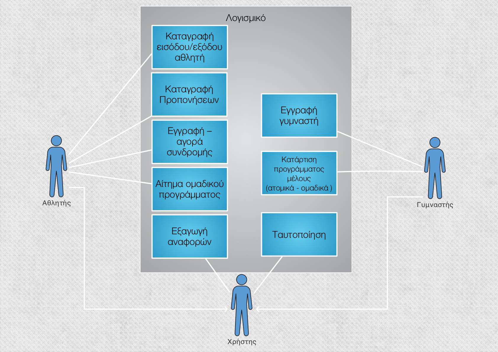

# Παραδοτέο R1

## Αναλυτική περιγραφή πεδίου προβλήματος:

### Εφαρμογή μέλους γυμναστηρίου

Σκοπός αυτής της εφαρμογής είναι η διευκόλυνση καθημερινών ενεργειών ενός μέλους
γυμναστηρίου.  Αρχικά μέσω της εφαρμογής θα είναι δυνατή η αγορά συνδρομής δηλαδή η εγγραφή ενός μέλους στο γυμναστήριο. Με την επιτυχή αγορά συνδρομής στο γυμναστήριο ο πελάτης θα έχει τον προσωπικό του κωδικό Barcode με τον οποίο θα εισέρχεται στον χώρο του γυμναστηρίου επικυρώνοντας την ταυτότητα του. Μέσω της εφαρμογής στη συνέχεια θα μπορεί να εγγράφεται σε ομαδικά προγράμματα βλέποντας πληροφορίες για το καθένα. Στην περίπτωση που ο χρήστης δεν έχει εγγραφεί σε κανένα ομαδικό πρόγραμμα θα γίνεται κατάρτιση ατομικού  προγράμματος εκγύμνασης  από γυμναστή. Για την ατομική προπόνηση θα υπάρχει μενού καταγραφής προόδου( σετ, κιλά, επαναλήψεις ) και εξαγωγής εξατομικευμένων αναφορών σχετικά με αυτήν κατά την διάρκεια της περιόδου εκγύμνασης.

## Απαιτήσεις :

    1. Καταγραφή εισόδου/εξόδου αθλητή. 
    2. Καταγραφή προπονήσεων.
    3. Εγγραφή-Αγορά συνδρομής.
    4. Εγγραφή σε ομαδικά προγράμματα.
    5. Ταυτοποίηση.
    6. Κατάρτιση προγράμματος μέλους.
    7. Εγγραφή γυμναστή.
    8. Εξαγωγή αναφορών.
   

## Συνοπτική ανάλυση απαιτήσεων:
    
    1. Το σύστημα καταγράφει πότε εισέρχεται και πότε εξέρχεται ο αθλητής από το γυμναστήριο χρησιμοποιώντας το προσωπικό του κωδικό bar-code.
    2. Ο αθλητής καταγράφει τη πρόοδο του ανάλογα με το πόσα κιλά σήκωσε και πόσες επαναλήψεις έκανε σε κάθε άσκηση.
    3. Αν πρόκειται για αθλητή που δεν έχει κάνει εγγραφή στο γυμναστήριο του δίνεται η δυνατότητα να εγγραφεί στο γυμναστήριο συμπληρώνοντας τα προσωπικά του στοιχεία. Του παρέχεται η δυνατότητα να ανανεώσει ή αγοράσει τη συνδρομή του. 
    4. Στον αθλητή παρέχεται η δυνατότητα να επιλέξει το ομαδικό πρόγραμμα της αρέσκειάς του ανάλογα εάν υπάρχουν διαθέσιμες θέσεις.
    5. Ύστερα από επιτυχή συμπλήρωση των πεδίων username και password o χρήστης εισέρχεται στην εφαρμογή και το σύστημα αναγνωρίζει εάν πρόκειται για αθλητή ή γυμναστή.
    6. Ο γυμναστής ανάλογα με τις προσδοκίες και τις δυνατότητες του αθλητή διαμορφώνει το προσωπικό του πρόγραμμα.
    7. Ένας καινούριος γυμναστής του γυμναστηρίου μπορεί να εγγραφεί στο σύστημα συμπληρώνοντας κατάλληλα στοιχεία.
    8. Το σύστημα εξάγει εβδομαδιαία αναφορές σχετικά με τη πρόοδο του αθλητή.

## Διάγραμμα Usecase:

