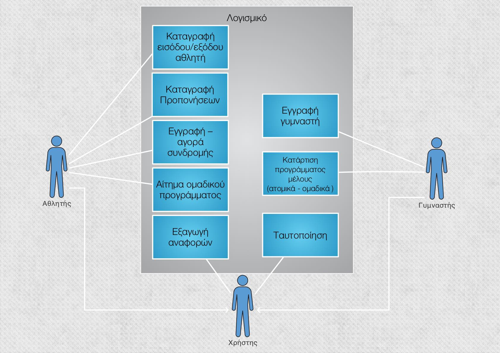
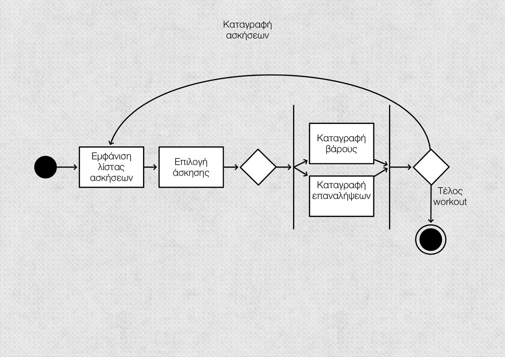
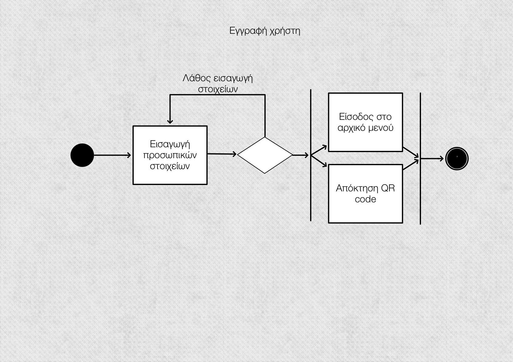
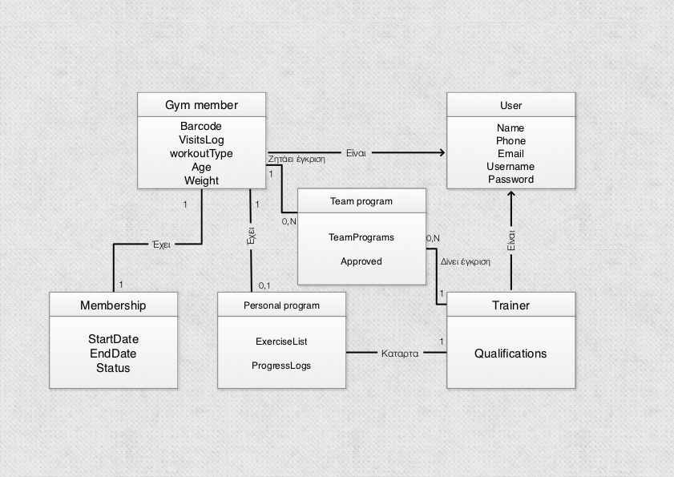
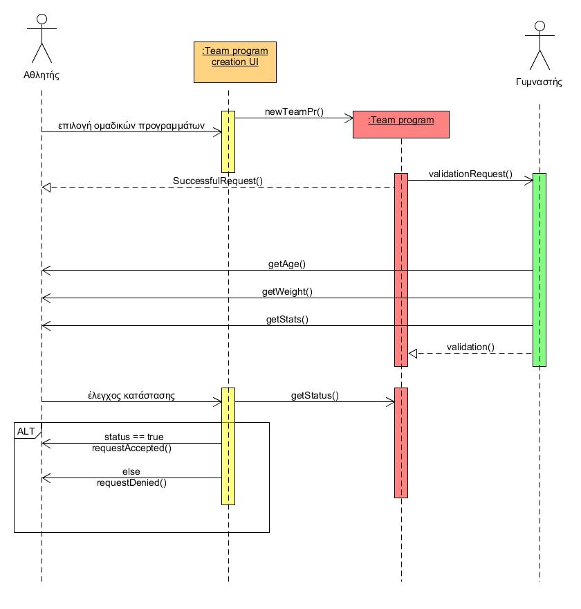
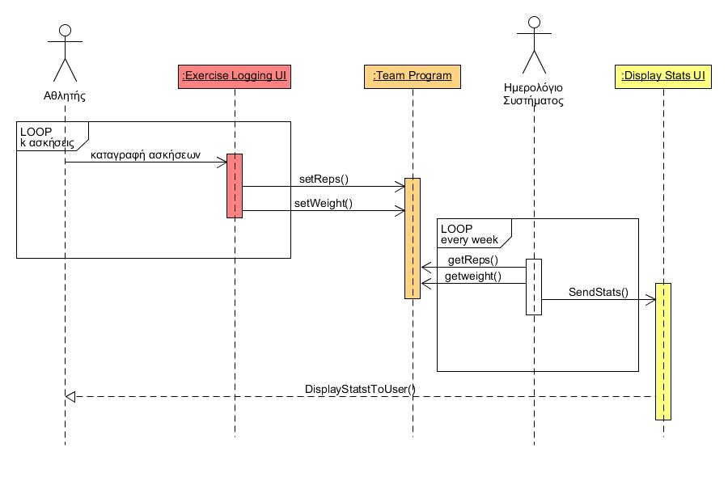
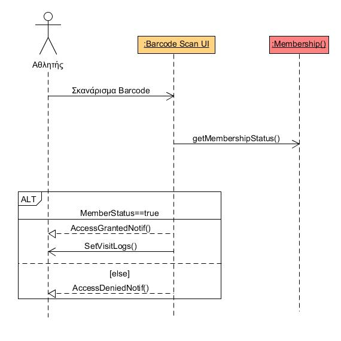

----------
# 2.1 Δημιουργία του μοντέλου περιπτώσεων χρήσης #

## 2.1.1. Διάγραμμα περιπτώσεων χρήσης (use case diagram) ##

## 2.1.2 Περιγραφή περιπτώσεων χρήσης ##

  **ΠΧ1** Καταγραφή εισόδου/εξόδου αθλητή

- **Πρωτεύων actor:** Αθλητης
- **Ενδιαφερόμενοι (stakeholders):** 
  Αθλητής: Σκανάρει το barcode του στην είσοδο-έξοδο
- **Προϋποθέσεις (Pre-conditions):** Ο αθλητής θα πρέπει να έχει κάνει log in στην εφαρμογή.
- **Βασική ροή:**
 1. Ο αθλητής βρίσκει στην εφαρμογή το barcode του.
 2. Ο αθλητής σκανάρει το barcode στο μηχάνημα.
 3. Ο αθλητής ολοκληρώνει την προπόνηση του.
 4. Ο αθλητής σκανάρει το barcode του και εξέρχεται από το γυμναστήριο.
- **Εναλλακτικές ροές:**  
 2α. Έχει λήξει η συνδρομή του αθλητή.  
> 1. Το σύστημα εμφανίζει μήνυμα σφάλματος και δεν επιτρέπει στον αθλητή να εισέλθει στο γυμναστήριο. 

 **ΠΧ2** Καταγραφή προπονήσεων 

- **Πρωτεύων actor:** Αθλητής
- **Ενδιαφερόμενοι (stakeholders):** Αθλητής: Καταγράφει τα κιλά και τις επαναλήψεις στις ασκήσεις που έχει κάνει ημερισίως.
- **Προϋποθέσεις (Pre-conditions):** Ο αθλητής θα πρέπει να έχει εγγραφεί στο σύστημα. Θα πρέπει να έχει γίνει κατάρτιση ατομικού προγράμματος από γυμναστή.
- **Βασική ροή:**
 1. Ο αθλητής επιλεγει ποια άσκηση έχει κάνει.
 2. Ο αθλητής καταγράφει τα κιλά και τις επαναλήψεις.
 3. Συνεχίζει τη παραπάνω διαδικασία μέχρι να καταγράψει όλες τις ασκήσεις που έχει κάνει.

  **ΠΧ3** Εγγραφη-αγορά συνδρομής

- **Πρωτεύων actor:** Αθλητής
- **Ενδιαφερόμενοι (stakeholders):** 
  Αθλητής: Εγγράφεται και αγοράζει συνδρομή για να εισέλθει στην εφαρμογή.
  (Σύστημα: Ελέγχει εάν έχει γίνει ορθά η εγγραφή του χρήστη.)
- **Προϋποθέσεις (Pre-conditions):** Ο αθλητής θα πρέπει να έχει συμπληρώσει τα απαραίτητα στοιχεία για την εγγραφή και να πληρώσει για την αγορά συνδρομής.
- **Βασική ροή:**
 1. Συμπλήρωση απαραίτητων προσωπικών στοιχείων του αθλητή.
 2. Επιλογη χρονικού διαστήματος συνδρομής(π.χ.6μήνες,12μήνες κλπ).
 3. Πληρωμή συνδρομής.
- **Εναλλακτικές ροές:**  
 1α. Ο αθλητής δεν συμπλήρωσε όλα τα απαιτούμενα στοιχεία που του ζητήθηκαν.  
> 1. Το σύστημα εμφανίζει μήνυμα σφάλματος και προτρέπει τον αθλητή να συμπληρώσει το υποχρεωτικό πεδίο. 

 3α. Δεν υπάρχει το απαιτούμενο ποσό της συνδρομής στη κάρτα.
> 1. Το σύστημα εμφανίζει μήνυμα σφάλματος και ενημερώνει το χρήστη ότι το ποσό δεν εξοφλήθηκε, διότι δεν υπάρχει το απαιτούμενο ποσό στη κάρτα του.
> 2. Το σύστημα προτρέπει τον χρήστη να επιλέξει άλλη μέθοδο πληρωμής.

 **ΠΧ4** Ταυτοποίηση

- **Πρωτεύων actor:** Χρήστης
- **Ενδιαφερόμενοι (stakeholders):** Χρήστης: Συνδέεται στο προσωπικό του λογαριασμό με username και password 
- **Προϋποθέσεις (Pre-conditions):** Ο χρήστης να έχει κάνει εγγραφή στο σύστημα.
- **Βασική ροή:**
 1. Ο χρήστης εισάγει το username του.
 2. Ο χρήστης εισάγει το password του.
 3. Ο χρήστης ταυτοποιείται και συνδέεται με επιτυχία στο σύστημα.
- **Εναλλακτικές ροές:**
 1α. Δεν υπάρχει το username.
>1. Το σύστημα εμφανίζει μήνυμα σφάλματος και προτρέπει το χρήστη να ξανασυμπληρώσει το πεδίο username.
 
 1β. Ο χρήστης δεν θυμάται το username.
>1. Επιλέξει το πλήκτρο 'Ξέχασα το username' και του αποστέλεται στο email του το username του.

 2α. Ο χρήστης πληκτρολόγησε λάθος password.
>1. Το σύστημα εμφανίζει μήνυμα σφάλματος και προτρέπει το χρήστη να ξανασυμπληρώσει το πεδίο password.
 
 1β. Ο χρήστης δεν θυμάται το password.
>1. Επιλέξει το πλήκτρο 'Ξέχασα το password' και του αποστέλεται στο email του το password του.

 **ΠΧ5** Κατάρτιση προγράμματος μέλους (ατομικά-ομαδικά)

- **Πρωτεύων actor:** Γυμναστής
- **Ενδιαφερόμενοι (stakeholders):** Γυμναστής: Δημιουργεί εξατομικευμένο πρόγραμμα για τις ανάγκες του αθλητή και τον προσθέτει σε ομαδικά προγράμματα εάν το επιθυμεί ο αθλητής.
Αθλητής: Ενημερώνει τον γυμναστή για επιθυμητά αποτελέσματα προπόνησης και τυχόν προβλήματα υγείας.
- **Προϋποθέσεις (Pre-conditions):** Ο γυμναστής έχει πάρει αίτημα δημιουργίας ατομικού και/ή προγράμματος από κάποιον αθλητή-μέλος.
- **Βασική ροή:**
 1. Ο αθλητής στέλνει αίτημα δημιουργίας ατομικού προγράμματος ή αίτημα εγγραφής του σε κάποιο ομαδικό πρόγραμμα στον γυμναστή.
 2. Ο γυμναστής μελετάει τα χαρακτηριστικά του αθλητή.
 3. Ο γυμναστής είτε φτιάχνει και αποστέλει το ατομικό πρόγραμμα του αθλητή ,είτε εγκρίνει ή απορρίπτει το αίτημα του αθλητή για συμμετοχή στο ομαδικό πρόγραμμα.

- **Εναλλακτικές ροές:**
 3α. Ο γυμναστής απορρίπτει το ομαδικό πρόγραμμα που θέλει να συμμετάσχει ο αθλητής.
>1. Ο αθλητής μπορεί να ζητήσει κάποιο άλλο ομαδικό πρόγραμμα.

 **ΠΧ6** Εγγραφή γυμναστή

- **Πρωτεύων actor:** Γυμναστής
- **Ενδιαφερόμενοι (stakeholders):** Γυμναστής: Δημιουργεί τον προσωπικό του λογαριασμό για πρόσβαση στην εφαρμογή.

- **Προϋποθέσεις (Pre-conditions):** Να δουλεύει στο συγκεκριμένο γυμναστήριο
- **Βασική ροή:**
 1. Ο γυμναστής συμπληρώνει τα προσωπικά του στοιχεία, το username του και το password.
 2. To σύστημα ελέγχει τα στοιχεία.
 3. Ο γυμναστής εγγράφτηκε με επιτυχία.
- **Εναλλακτικές ροές:**
 1α. Ο γυμναστής δεν έχει συμπληρώσει κάποιο υποχρεωτικό πεδίο.
>1. Το σύστημα του εμφανίζει κατάλληλο μήνυμα για να συμπληρώσει το συγκεκριμένο πεδίο.

 **ΠΧ7**Εξαγωγή αναφορών

- **Πρωτεύων actor:** Χρηστης 
- **Ενδιαφερόμενοι (stakeholders):** Γυμναστης: Ενημερωνεται για την προοδο- κατασταση ενος αθλητη. Αθλητής: ενημερώνεται για την πρόοδό του.
- **Προϋποθέσεις (Pre-conditions):** 
 1. Θα πρέπει ο αθλητής να έχει συμπληρώσει 2 βδομάδες προπόνησης.
 2. Θα πρέπει να έχει κάνει καταγραφή των ασκήσεών του τουλάχιστον 1 φορά την εβδομάδα.
   
- **Βασική ροή:**
 1. Μια φορά την εβδομάδα θα εξετάζονται και υπολογίζονται τα στοιχεία του κάθε αθλητή.
 2. Δημιουργούνται αναφορές και στατιστικά στοιχεία για τη πρόοδό του.
 3. Εμφανίζονται τα τελικά αποτελέσματα των αναφορών στον αθλητή.
 
- **Εναλλακτικές ροές:**
 1. Ο αθλητής δεν έχει καταγράψει τον προαπαιτούμενο αριθμό ασκήσεων για την διεξαγωγή αναφορών.
>Το σύστημα εμφανίζει κατάλληλο μήνυμα σχετικά με το ότι δεν υπάρχουν αρκετά στοιχεία για τη διεξαγωγή αναφορών προόδου.

**ΠΧ8** Αίτημα Ομαδικού Προγράμματος

**Πρωτεύων actor:** Αθλητής

**Ενδιαφερόμενοι (stakeholders):** Αθλητής: Ζητάει έγκριση για την συμμετοχή του.

**Προϋποθέσεις (Pre-conditions):** Ο αθλητής θα πρέπει να έχει εγγραφεί στο σύστημα.

**Βασική ροή:**

1. Ο αθλητής επιλεγει σε ποιο ομαδικό πρόγραμμα θέλει να συμμετάσχει.
2. Δημιουργεί ένα αίτημα για το συγκεκριμένο ομαδικό πρόγραμμα.

## 2.1.3. Οι σημαντικότερες περιπτώσεις χρήσης θα συνοδεύονται και από κατάλληλα διαγράμματα δραστηριότητας (activity diagrams). ##

# 2.2. Συμπληρωματικές προδιαγραφές για τις μη λειτουργικές απαιτήσεις #

- **Απόδοση**
 1. Η εφαρμογή θα πρέπει να έχει γρήγορο χρόνο απόκρισης σε αιτήματα του χρήστη και καλή ταχύτητα εκτέλεσης.
 2. Το σύστημα θα πρέπει να υποστηρίζει έως και 100 ταυτόχρονους χρήστες.
 3. Η απόκριση της εφαρμογής σε οποιοδήποτε ερέθισμα του χρήστη δεν πρέπει να ξεπερνά τα 5 δευτερόλεπτα.
 
- **Διαθεσιμότητα**
 1. Η εφαρμογή είναι διαθέσιμη 24 ώρες για 7 ημέρες της εβδομάδας.

- **Ασφάλεια**
 1. Για να μπορεί κάποιος να έχει πρόσβαση στην εφαρμογή πρέπει υποχρεωτικά να έχει εγγραφεί  στο σύστημα και να πραγματοποιήση τη διαδικασία αυθεντικοποίησής του.
 2. Η εφαρμογή τηρεί τα πρότυπα του GDPR για την προστασία των προσωπικών δεδομένων των χρηστών.
 
- **Ευελιξία**
 1. Σε περίπτωση δημιουργίας νέας έκδοσης της εφαρμογής, η προσαρμογή της με όλα τα δεδομένα της βάσης δεδομένων δεν θα πρέπει να ξεπερνά τις 3 ημέρες.

- **Ευχρηστία**
 1. Η μόνη απαίτηση για τον τελικό χρήστη είναι να γνωρίζει τον τρόπο εύρεσης και εγκατάστασης της εφαρμογής.
 2. Ο χρήστης θα πρέπει να είναι σε θέση να χρησιμοποιεί την εφαρμογή μετά από 2 ημέρες χρήσης της.

 # 2.3 Ανάλυση απαιτήσεων #

## 2.3.1. Το μοντέλο πεδίου που περιλαμβάνει τις βασικές κλάσεις του πεδίου προβλήματος, τις ιδιότητές τους και τις σχέσεις μεταξύ τους. ##

## 2.3.2. Περιγραφή των σεναρίων εκτέλεσης των σημαντικότερων περιπτώσεων χρήσης με χρήση διαγραμμάτων ακολουθίας (sequence diagrams). ##
 

