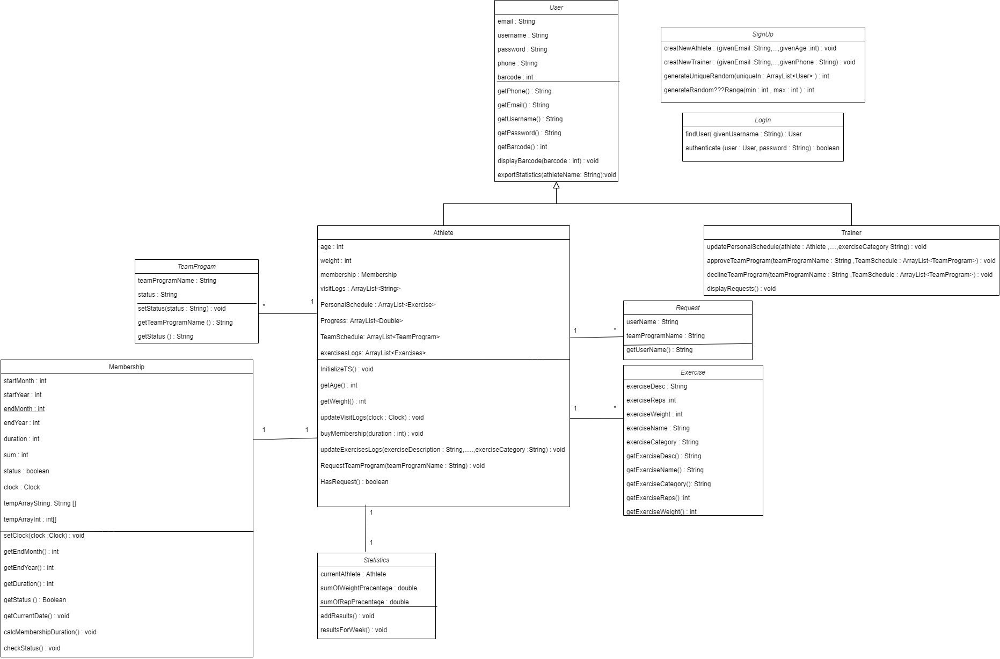
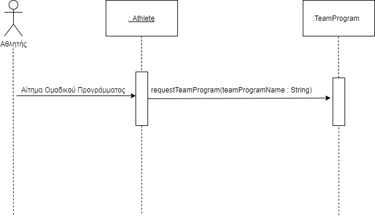
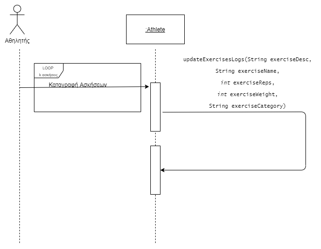
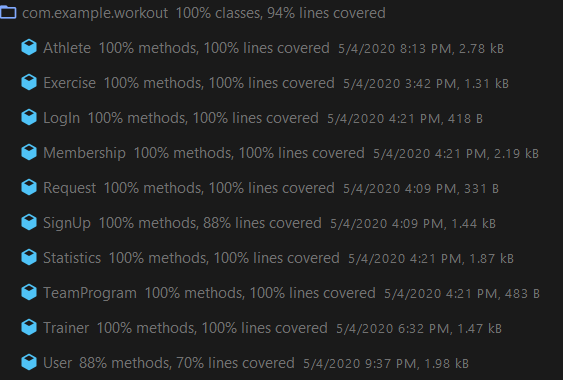

### Επιμέλεια: ΖΩΗ ΛΕΒΕΣΑΝΟΥ 3150240, ΣΠΥΡΙΔΩΝ ΜΠΑΖΙΟΣ 3170113, ΕΜΜΑΝΟΥΗΛ ΣΚΑΝΔΑΛΗΣ 3170144 ###

----------
# R.3. Σχεδίαση και υλοποίηση της λογικής του πεδίου. #

## 3.1. Διάγραμμα κλάσεων και διαγράμματα ακολουθίας ##

----------

## 3.2. Υλοποίηση της λογικής του πεδίου σε Java ##

Η υλοποίηση έχει γίνει μέσω της πλατφόρμας του Android Studio.

## 3.3. Αυτόματοι έλεγχοι σε JUnit οι οποίοι ελέγχουν τη λογική του πεδίου ##

Η υλοποίηση έχει γίνει μέσω της πλατφόρμας του Android Studio.

## 3.4. Αναφορές καλύψεων του κώδικα (coverage reports). ##

