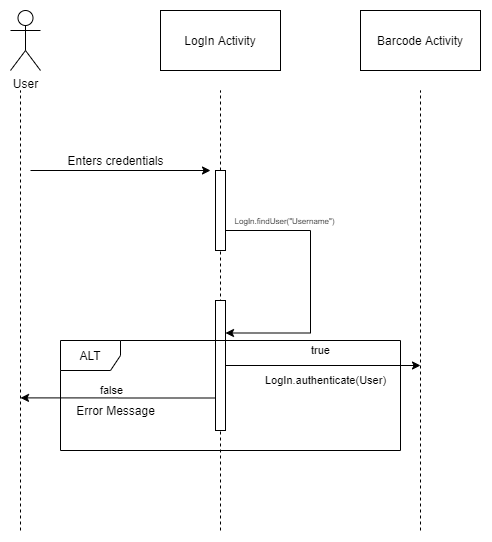
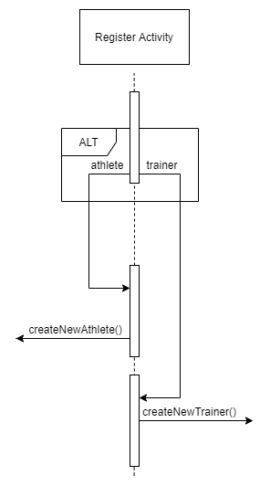

### Επιμέλεια: ΖΩΗ ΛΕΒΕΣΑΝΟΥ 3150240, ΣΠΥΡΙΔΩΝ ΜΠΑΖΙΟΣ 3170113, ΕΜΜΑΝΟΥΗΛ ΣΚΑΝΔΑΛΗΣ 3170144 ###

----------
# R.4.  Σχεδίαση και υλοποίηση του συστήματος #

## Disclaimer ##

Στην παρούσα εργασία κάναμε την υλοποίηση του συστήματος πριν τις υποδείξεις των φροντιστηρίων και των παραδειγμάτων οπότε δεν χρησιμοποιήσαμε interfaces και μοντέλο presenter.Οι περισσότερες ενέργειες  έγιναν μέσα στις μεθόδους on create των activities Όπου και γινόταν η κλήση κατάλληλων μεθόδων από το παραδοτέο R3.Ετσι δεν καταφέραμε να κάνουμε κάποια τεστ και να τα τεκμηριώσουμε  με javadoc. 

Παρόλα αυτά το τελικό αποτέλεσμα είναι λειτουργικό και σύμφωνο με τις περισσότερες απαιτήσεις των προηγουμένων παραδοτέων.

----------

## Διάγραμμα ακολουθίας ##

----------

